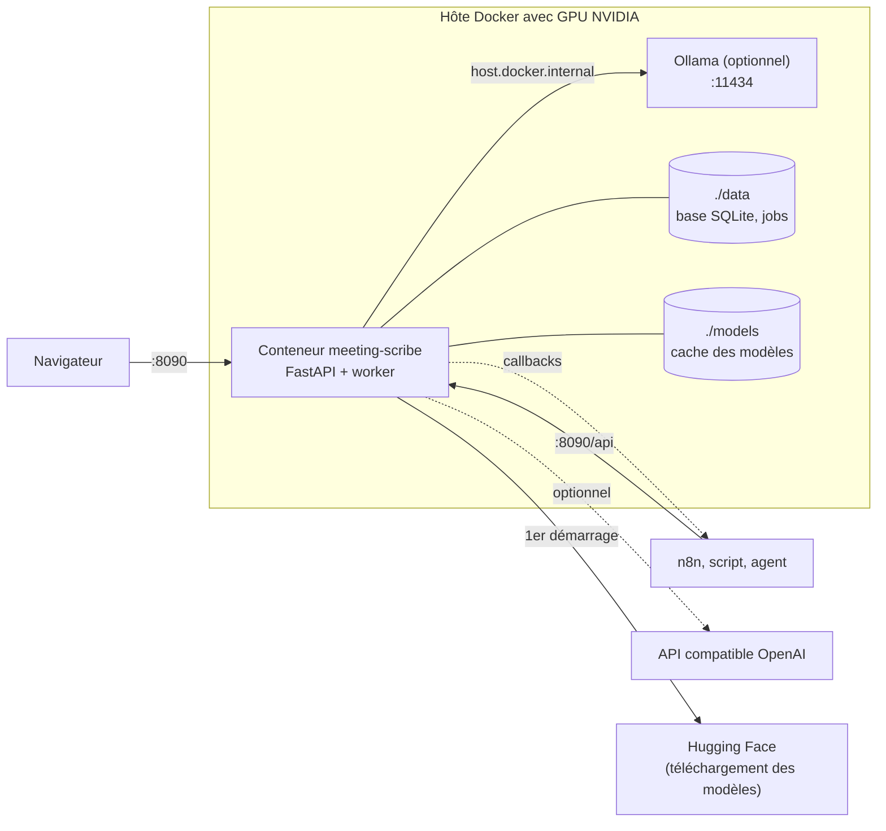
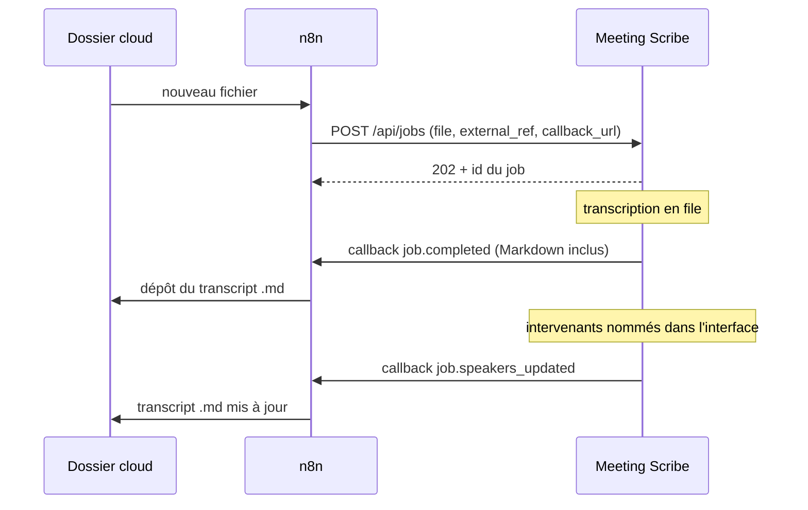

<p align="center"></p>

# Meeting Scribe

Service auto-hébergé de transcription de réunions, en français ou en anglais : identification des intervenants, transcript Markdown horodaté et compte rendu généré par un LLM, local ou distant.

- **Entrées** : fichiers audio ou vidéo (`.m4a` d'iPhone, `.mp4`…) ou URL YouTube.
- **Chaîne de traitement** : [WhisperX](https://github.com/m-bain/whisperX) 3.8.6, c'est-à-dire faster-whisper `large-v3`, `large-v3-turbo` ou `small`, alignement mot à mot, puis diarisation avec `pyannote/speaker-diarization-community-1`.
- **Deux images Docker** : `cuda` pour une carte NVIDIA, `cpu` pour un PC ou un Mac sans GPU. Le modèle de diarisation y est embarqué : aucun compte Hugging Face n'est nécessaire.
- **Intervenants** : ils sont séparés automatiquement, puis nommés dans l'interface après écoute de courts extraits. Aucune empreinte vocale n'est conservée.
- **Comptes rendus** : [Ollama](https://ollama.com) en local, ou n'importe quelle API compatible OpenAI (OpenAI, Mistral, OpenRouter…).
- **Toute la logique est dans l'API** (`/api`, documentation interactive sur `/docs`). L'interface web n'en est qu'un client : n8n, un script ou un agent peuvent faire exactement la même chose.
- **Un seul traitement à la fois**, pour qu'une seule carte graphique suffise : avant chaque transcription, les modèles d'Ollama sont déchargés de la VRAM quand il tourne sur la même machine.

Né pour remplacer [Whishper](https://github.com/pluja/whishper), qui n'est plus maintenu.

## Sommaire

- [Fonctionnement](#fonctionnement)
- [Prérequis](#prérequis)
- [Installation](#installation)
- [Configuration](#configuration)
- [Utilisation](#utilisation)
- [Automatisation](#automatisation)
- [API en bref](#api-en-bref)
- [Format du transcript](#format-du-transcript)
- [Exploitation](#exploitation)
- [Dépannage](#dépannage)
- [Développement](#développement)
- [Licence](#licence)

## Fonctionnement

### Flux d'une réunion

```mermaid
flowchart LR
    A["Fichier .m4a / .mp4<br>ou URL YouTube"] -->|"POST /api/jobs"| Q["File d'attente<br>(un traitement à la fois)"]
    Q --> G["Libération du GPU<br>(déchargement d'Ollama)"]
    G --> T["Transcription<br>faster-whisper"]
    T --> AL["Alignement<br>mot à mot"]
    AL --> D["Diarisation<br>pyannote"]
    D --> S["Intervenants S1, S2…<br>+ extraits audio"]
    S -->|"nommage dans l'interface<br>ou PUT /speakers"| MD["Transcript Markdown<br>(noms à jour)"]
    MD -->|"optionnel"| CR["Compte rendu LLM<br>Ollama ou API OpenAI"]
    MD -.->|"callback"| W["Webhook<br>(n8n…)"]
    CR -.->|"callback"| W
```



1. Un fichier ou une URL est déposé, par l'interface ou par l'API. Le job entre dans la file.
2. Le worker libère le GPU, convertit l'audio, transcrit, aligne chaque mot sur l'audio, puis attribue chaque mot à une voix.
3. Les voix sont nommées `S1`, `S2`… avec trois courts extraits chacune. On leur donne un nom en les écoutant ; donner le même nom à deux voix les fusionne.
4. Le transcript Markdown est rendu à la demande, toujours avec les noms courants.
5. En option, un LLM rédige un compte rendu à partir du transcript.
6. Si une `callback_url` a été fournie, chaque étape importante (job terminé ou en échec, intervenants renommés, compte rendu prêt) y est envoyée, Markdown compris.

### Déploiement



Un seul conteneur suffit. Ollama, l'API distante et n8n sont facultatifs.

## Prérequis

Deux images, selon la machine :

| | Image `cuda` | Image `cpu` |
|---|---|---|
| Pour | PC ou serveur avec carte NVIDIA | PC sans carte NVIDIA, Mac Apple Silicon |
| Système | Linux x86_64, ou Windows 10/11 avec Docker Desktop (WSL2) | Linux, Windows ou macOS (x86_64 ou arm64) |
| GPU | NVIDIA, 12 Go de VRAM en `large-v3`, 8 Go en `large-v3-turbo` ; pilote 570 ou plus récent | aucun |
| Docker | Docker Engine et Compose v2, avec le [NVIDIA Container Toolkit](https://docs.nvidia.com/datacenter/cloud-native/container-toolkit/latest/install-guide.html) sous Linux | Docker Engine et Compose v2, ou Docker Desktop |
| Mémoire vive | 16 Go | 16 Go |
| Disque | environ 20 Go (image 13,5 Go, modèles 5 Go) | environ 8 Go (image 4,5 Go, modèles 3 Go) |
| Vitesse | une interview de 8 min en 40 s (`large-v3-turbo`) à 60 s (`large-v3`) sur une RTX 3090 | environ 0,3 × la durée de la réunion en `small` sur un Intel i7-12700 (2 min 25 pour 8 min d'audio), 0,4 × en `large-v3-turbo` ; compter 2 à 3 fois plus sur un portable |
| Ollama | facultatif, pour les comptes rendus en local | idem, ou une API distante |

Pics de VRAM mesurés : environ 10 Go en `large-v3`, 4,5 Go en `large-v3-turbo`. L'image `cuda` embarque CUDA 12.8 par les roues de PyTorch : rien à installer côté CUDA.

Vérifier que Docker voit le GPU (image `cuda`) :

```bash
docker run --rm --gpus all ubuntu nvidia-smi
```

## Installation

### Avec l'image publiée

Il suffit d'un dossier contenant le fichier Compose et le `.env` :

```bash
mkdir meeting-scribe && cd meeting-scribe
BASE=https://raw.githubusercontent.com/lenny-ai-data/meeting-scribe/main
curl -fsSLO $BASE/compose.yaml              # carte NVIDIA
curl -fsSLO $BASE/compose.cpu.yaml          # ou : sans GPU
curl -fsSL -o .env $BASE/.env.example       # tout est facultatif

mkdir -p data models                        # avant le premier démarrage, sinon Docker les crée en root
docker compose up -d                        # carte NVIDIA
docker compose -f compose.cpu.yaml up -d    # ou : sans GPU
```

Ouvrir ensuite `http://localhost:8090`, ou `http://<adresse-du-serveur>:8090` depuis un autre poste : le voyant en haut de page doit être vert. Choisir enfin le modèle de langage des comptes rendus dans *Réglages* (voir [Comptes rendus](#comptes-rendus)). La documentation de l'API est sur `/docs`.

Pour vérifier en ligne de commande :

```bash
curl -s http://localhost:8090/api/system | jq .status
# {"state": "ready", "problems": [], "warnings": [...]}
```

Au premier job, les modèles de transcription et d'alignement sont téléchargés dans `./models` (environ 3 Go pour `large-v3`, 1,6 Go pour `large-v3-turbo`, 500 Mo pour `small`, plus 1,2 Go d'alignement pour le français) : ce premier job est donc plus long que les suivants.

**Windows** : installer [Docker Desktop](https://docs.docker.com/desktop/setup/install/windows-install/) avec le moteur WSL2, puis lancer les mêmes commandes dans PowerShell (`curl.exe` au lieu de `curl`, `mkdir data, models`). Avec une carte NVIDIA, un pilote récent suffit : Docker Desktop transmet le GPU aux conteneurs.

**Mac** : Docker Desktop, image `cpu` (le GPU des Mac n'est pas accessible aux conteneurs).

> **Utilisateur de l'hôte (Linux)** : le conteneur tourne avec l'uid 1000, l'utilisateur par défaut d'Ubuntu. Si `id -u` renvoie une autre valeur, donner les dossiers à l'uid 1000 : `sudo chown -R 1000:1000 data models`.

### Depuis le dépôt (construction locale)

```bash
git clone https://github.com/lenny-ai-data/meeting-scribe.git
cd meeting-scribe
cp .env.example .env
mkdir -p data models
docker compose up -d --build                        # image cuda
docker compose -f compose.cpu.yaml up -d --build    # ou : image cpu
```

Le modèle de diarisation n'est embarqué à la construction que si `HF_TOKEN` est renseigné dans le `.env` (voir ci-dessous) ; sinon, ce même jeton sera exigé à l'exécution.

### Jeton Hugging Face (facultatif)

Inutile avec les images publiées. Il ne sert qu'à construire soi-même une image avec le modèle de diarisation, ou à utiliser un autre modèle pyannote :

1. Se connecter sur Hugging Face et accepter les conditions de [pyannote/speaker-diarization-community-1](https://huggingface.co/pyannote/speaker-diarization-community-1).
2. Créer un jeton de type *Read* dans [Settings → Access Tokens](https://huggingface.co/settings/tokens), puis le mettre dans `HF_TOKEN`.

## Configuration

Toutes les variables sont dans [.env.example](.env.example), commentées. Après une modification du `.env` : `docker compose up -d`.

### Variables principales

| Variable | Défaut | Rôle |
|---|---|---|
| `HF_TOKEN` | — | Jeton Hugging Face. Inutile si le modèle de diarisation est embarqué dans l'image (`DIARIZATION_MODEL_DIR`) |
| `DEFAULT_MODEL` | `large-v3` (image `cuda`), `small` (image `cpu`) | `large-v3` (le plus précis), `large-v3-turbo` (précis, plus rapide, moins de VRAM) ou `small` (rapide, pour le CPU) |
| `CPU_DIARIZATION_STEP` | `2.5` | Pas des fenêtres de diarisation sur CPU, en secondes (pyannote : 1 s). Plus grand = plus rapide, mais les prises de parole très brèves risquent d'être absorbées |
| `DEFAULT_LANGUAGE` | `fr` | `fr` ou `en` |
| `DEFAULT_DEVICE` | `cuda` | `cuda` ou `cpu` |
| `BATCH_SIZE` | 16 sur GPU, 4 sur CPU | Passages de 30 s transcrits par lot. La progression n'avance qu'à la fin de chaque lot : sur CPU, 4 la met à jour environ toutes les 20 s, pour 4 % de temps en plus |
| `MIN_FREE_VRAM_GB` | selon le modèle | En dessous, le job échoue avec un message clair plutôt qu'avec une erreur CUDA. Par défaut : 10 Go en `large-v3`, 6 Go en `large-v3-turbo`, 4 Go en `small` |
| `DIARIZATION_MODEL_DIR` | `/opt/models/pyannote/speaker-diarization-community-1` | Copie locale du modèle pyannote ; si elle existe, ni jeton ni réseau ne sont nécessaires |
| `OLLAMA_URL` | `http://host.docker.internal:11434` | Ollama de l'hôte (valeur initiale, modifiable dans *Réglages*) |
| `OLLAMA_MODEL` | — | Modèle des comptes rendus ; vide = premier modèle installé |
| `OLLAMA_UNLOAD_BEFORE_GPU` | automatique | Décharger Ollama avant une transcription GPU ; par défaut, seulement s'il tourne sur la même machine |
| `OLLAMA_MAX_CTX` | `65536` | Plafond du contexte ; le contexte réel est ajusté à la longueur du transcript |
| `LLM_API_BASE_URL`, `LLM_API_KEY`, `LLM_API_MODEL` | — | API compatible OpenAI, en plus ou à la place d'Ollama (valeurs initiales, modifiables dans *Réglages*) |
| `API_TOKEN` | — | Si défini, chaque appel à `/api` doit porter `Authorization: Bearer <jeton>` |
| `CALLBACK_TOKEN` | — | Envoyé dans l'en-tête `X-Scribe-Token` des callbacks |
| `PUBLIC_BASE_URL` | — | Adresse publique du service, pour mettre des liens absolus dans les callbacks |
| `OWNER_NAME` | — | Votre nom, proposé dans l'interface pour nommer un intervenant |
| `MAX_UPLOAD_MB` | `4096` | Taille maximale d'un fichier déposé |
| `TZ` | `Europe/Paris` | Fuseau horaire des dates de réunion |

### Port et accès

Le service écoute sur le port 8000 du conteneur, publié sur le **8090** de l'hôte. Pour en changer, modifier `ports` dans [compose.yaml](compose.yaml), par exemple `"9000:8000"`.

Par défaut, l'API n'a pas d'authentification : c'est prévu pour un réseau local. Si le service est exposé plus largement :
- définir `API_TOKEN` ;
- le placer derrière un reverse proxy en HTTPS (les en-têtes `X-Forwarded-*` sont pris en compte).

L'interface ne s'appuie que sur des URL relatives : elle fonctionne quelle que soit l'adresse par laquelle on y accède.

### Comptes rendus

Trois possibilités, cumulables. Le fournisseur se choisit au moment de générer le compte rendu. Tout se règle dans *Réglages › Modèles de langage* (ou par `PUT /api/settings/llm`), avec un bouton « Tester » qui liste les modèles disponibles ; ces réglages priment sur le `.env`, qui ne fournit que les valeurs initiales.

**Ollama sur le même hôte** (configuration par défaut) :
1. Installer Ollama et télécharger un modèle : `ollama pull qwen3:8b`, ou un modèle plus gros si la VRAM le permet. Sans modèle par défaut choisi, le premier modèle installé est utilisé.
2. Le rendre joignable depuis les conteneurs. Par défaut, Ollama n'écoute que sur `127.0.0.1`, que le conteneur ne peut pas atteindre :
   ```bash
   sudo systemctl edit ollama
   # ajouter :
   # [Service]
   # Environment="OLLAMA_HOST=0.0.0.0"
   sudo systemctl restart ollama
   ```
   Dans ce cas, protéger le port 11434 par le pare-feu si la machine est accessible de l'extérieur.

Ollama et WhisperX ne tiennent généralement pas ensemble sur la carte. Meeting Scribe décharge donc les modèles d'Ollama avant chaque transcription, et fait passer les comptes rendus par la même file d'attente : les deux ne tournent jamais en même temps.

**Ollama ailleurs** (une station du réseau) : indiquer son adresse, par exemple `http://192.168.1.20:11434`, avec Ollama lancé en `OLLAMA_HOST=0.0.0.0` sur cette machine. Meeting Scribe ne décharge Ollama avant une transcription que s'il tourne sur la même machine (`host.docker.internal`, `localhost`) ; le réglage « Libération du GPU » force l'un ou l'autre comportement.

**API compatible OpenAI** : un service en ligne (OpenAI, Mistral, OpenRouter…) ou un serveur local qui expose `/v1/chat/completions` (LM Studio, llama.cpp, vLLM). Renseigner l'adresse (préréglages proposés), la clé si nécessaire et le modèle. La clé est enregistrée en base et n'est jamais renvoyée par l'API. Avec un service en ligne, le transcript complet est envoyé à ce fournisseur.

**Aucun LLM** : la transcription fonctionne seule. Le voyant signale simplement qu'Ollama est injoignable.

Le prompt système des comptes rendus se modifie dans *Réglages* ; un prompt par défaut en français est créé au premier démarrage.

### Sans GPU

Utiliser l'image `cpu` ([compose.cpu.yaml](compose.cpu.yaml)). Son profil privilégie la vitesse : `small` en int8 et une diarisation au pas de 2,5 s, soit environ 0,3 × la durée de la réunion sur un processeur de bureau récent, 2 à 3 fois plus sur un portable. Le compte rendu par LLM rattrape bien les erreurs de transcription. Pour une transcription plus fidèle (noms propres, chiffres), choisir `large-v3-turbo` dans le formulaire : environ 1,6 fois plus long.

Mesures sur une interview radio de 7 min 54 en français (i7-12700, 10 threads), taux d'erreur par mot (WER) comparé à `large-v3` sur GPU :

| Modèle | Transcription | WER |
|---|---|---|
| `small` (par défaut sur CPU) | 47 s | 15 % |
| `large-v3-turbo` | 94 s | 6 % |
| `medium` (non proposé : plus lent que turbo) | 117 s | 9 % |
| `base`, `tiny` (non proposés) | 19 s, 13 s | 28 %, 36 % |

### YouTube

- yt-dlp est mis à jour à chaque démarrage (`YTDLP_AUTO_UPDATE=true`), car YouTube casse régulièrement les anciennes versions. Il s'appuie sur Deno, inclus dans l'image.
- Si YouTube réclame une connexion, exporter les cookies d'un navigateur connecté au format Netscape (avec une extension du type *Get cookies.txt*) vers `data/config/youtube-cookies.txt`.

## Utilisation

1. **Déposer** un fichier ou coller une URL YouTube, puis régler les options affichées sous la zone de dépôt : titre, date, vocabulaire (noms propres, jargon), modèle, langue, calcul et nombre maximal d'intervenants.
2. **Suivre** : les réunions sont listées dans la barre de gauche. Le voyant de l'en-tête indique l'état du service : vert prêt, doré occupé, rouge en panne (détail au survol).
3. **Nommer les intervenants** : une fois le job terminé, la frise montre qui parle quand ; un clic lance la lecture à cet endroit. Nommer chaque voix dans le titre de sa carte après avoir écouté l'extrait (▶) ou les trois (⌄).
   - Donner le même nom à deux intervenants les fusionne.
   - Si le nombre de voix est faux, « Relancer la diarisation » en imposant le bon nombre (environ 1 min, sans refaire la transcription).
4. **Compte rendu** : le générer (prompt système plus consignes propres à la réunion), le retoucher au besoin avec « Modifier », puis le télécharger. Le **transcript `.md`** est dans la section qui précède, repliée par défaut.

La date de la réunion est préremplie avec la date d'enregistrement du fichier quand elle est connue (c'est le cas des mémos vocaux d'iPhone), sinon avec la date de dépôt ; pour YouTube, la date de publication.

## Automatisation

Tout passe par l'API ; la manière la plus simple est d'y associer un **callback**.



- Événements : `job.completed`, `job.failed`, `job.speakers_updated`, `summary.completed`.
- Le Markdown est inclus dans le message : pas besoin d'une seconde requête.
- `external_ref` (par exemple l'identifiant du fichier source) est renvoyé tel quel.
- En cas d'échec, 3 nouvelles tentatives (après 5, 15 puis 45 s) ; le résultat est dans le champ `callback_status` du job.

Deux workflows n8n prêts à importer (Google Drive → transcription → Google Drive) et le détail des messages sont dans [docs/n8n/](docs/n8n/README.md).

## API en bref

| Appel | Rôle |
|---|---|
| `POST /api/jobs` (multipart) | `file` ou `url`, plus `model`, `language`, `device`, `num_speakers` / `min_speakers` / `max_speakers`, `vocabulary`, `title`, `meeting_date`, `source_name`, `external_ref`, `callback_url` |
| `GET /api/jobs`, `GET /api/jobs/{id}` | Statut (`queued`, `downloading`, `preparing`, `transcribing`, `aligning`, `diarizing`, `completed`, `failed`, `cancelled`), progression (`progress`, et `progress_detail` : téléchargement d'un modèle, lot en cours…), intervenants |
| `PATCH /api/jobs/{id}` | Titre, date |
| `POST /api/jobs/{id}/cancel`, `DELETE /api/jobs/{id}` | Annuler, supprimer |
| `GET /api/jobs/{id}/speakers` | Intervenants, temps de parole, extraits (`…/samples/{n}.mp3`) |
| `PUT /api/jobs/{id}/speakers` | `{"S1": "Alice", "S2": "Bob"}` |
| `POST /api/jobs/{id}/rediarize` | `{"num_speakers": 3}` |
| `GET /api/jobs/{id}/transcript.md` / `.json` | Transcript (noms à jour) |
| `GET /api/jobs/{id}/timeline?bins=240` | Frise : passages de parole par intervenant et enveloppe d'amplitude de l'audio |
| `POST /api/jobs/{id}/summaries` | `{"meeting_prompt": "…", "provider": "ollama" \| "openai", "prompt_id": "…", "think": false}` |
| `GET /api/summaries/{id}.md` | Compte rendu |
| `PATCH /api/summaries/{id}` | `{"content": "…"}` : retoucher le texte d'un compte rendu terminé |
| `GET/POST/PUT/DELETE /api/prompts` | Prompts système |
| `GET/PUT /api/settings/llm` | Fournisseurs LLM : adresse, modèle, clé (écriture seule) ; mise à jour partielle, `null` = valeur du `.env` |
| `POST /api/settings/llm/test`, `GET /api/llm/models?provider=` | Tester un fournisseur, lister ses modèles |
| `GET /api/system` | GPU, Ollama, file d'attente, versions ; `status.state` = `error`, `busy` ou `ready` |
| `GET /api/health` | Toujours ouvert, même avec `API_TOKEN` |

Exemple complet :

```bash
SCRIBE=http://localhost:8090        # adresse du service
# AUTH=(-H "Authorization: Bearer $API_TOKEN")   # si API_TOKEN est défini, puis ajouter "${AUTH[@]}" à chaque appel

ID=$(curl -s -F file=@reunion.m4a -F title="Point hebdo" $SCRIBE/api/jobs | jq -r .id)
curl -s $SCRIBE/api/jobs/$ID | jq .status                     # jusqu'à "completed"
curl -s -X PUT -H 'Content-Type: application/json' -d '{"S1":"Alice","S2":"Bob"}' \
     $SCRIBE/api/jobs/$ID/speakers
curl -s -o transcript.md $SCRIBE/api/jobs/$ID/transcript.md
```

## Format du transcript

En-tête YAML (`title`, `date`, `duration`, `duration_seconds`, `language`, `model`, `diarization`, `speakers`, `source_file`, `source_url`, `job_id`, `generated_at`), puis les tours de parole :

```markdown
**Alice** [00:00:12]
Bonjour à tous…

[00:01:45] Deuxième paragraphe du même tour, après une pause.

**Bob** [00:02:10]
…
```

Les frontières des tours sont recalées sur les fins de phrase, et la ponctuation isolée reste attachée au mot qui la précède.

## Exploitation

- **Données**, dans `./data` :
  - `scribe.db` : base SQLite (jobs, intervenants, prompts, comptes rendus) ;
  - `jobs/<id>/` : pour chaque job, la source, `audio.wav`, les résultats JSON, les extraits et `pipeline.log`, le journal complet du traitement ;
  - `config/` : cookies YouTube éventuels.
- **Sauvegarde** : le dossier `./data` suffit. `./models` n'est qu'un cache, retéléchargeable.
- **Mise à jour** : `docker compose pull && docker compose up -d` avec l'image publiée (ajouter `-f compose.cpu.yaml` pour l'image `cpu`), ou `git pull && docker compose up -d --build` depuis le dépôt.
- **Journaux** : `docker compose logs -f meeting-scribe`, et `data/jobs/<id>/pipeline.log` pour un job précis.
- **Performances** pour une interview de 8 min, modèles déjà téléchargés : environ 40 s en `large-v3-turbo` et 60 s en `large-v3` sur une RTX 3090 ; 2 min 25 en `small` sur CPU (i7-12700).
- **VRAM** : le pic est atteint pendant la transcription, environ 10 Go en `large-v3` et 4,5 Go en `large-v3-turbo` (`BATCH_SIZE=16`). La diarisation n'a besoin que d'environ 1,6 Go, même si elle occupe davantage quand la carte est libre. Toute la mémoire est rendue à la fin du job, car chaque traitement tourne dans un sous-processus.
- **Redémarrage** : une tâche interrompue est relancée une fois, puis marquée en échec.

## Dépannage

| Symptôme | Cause probable |
|---|---|
| Voyant rouge, « HF_TOKEN manquant » | Image construite sans le modèle de diarisation : renseigner `HF_TOKEN` dans le `.env`, ou utiliser l'image publiée |
| Voyant rouge, « GPU introuvable » | NVIDIA Container Toolkit absent ou mal configuré : tester `docker run --rm --gpus all ubuntu nvidia-smi`. Sans carte NVIDIA, utiliser l'image `cpu` |
| `could not select device driver "nvidia"` au démarrage | Pas de runtime NVIDIA : utiliser `compose.cpu.yaml` |
| Diarisation en échec, erreur 401 ou 403 | Conditions de `pyannote/speaker-diarization-community-1` non acceptées sur le compte du jeton |
| « VRAM libre insuffisante » | Un autre programme occupe la carte (autre service de transcription, modèle chargé hors Ollama…) |
| « Carte de N Go : trop petite pour ce modèle » | Choisir `large-v3-turbo` ou `small`, ou le CPU |
| `Permission denied` sur `/data` ou `/models` | Dossiers créés en root ou par un autre uid : `sudo chown -R 1000:1000 data models` |
| « Ollama injoignable » | Ollama arrêté, ou n'écoute que sur `127.0.0.1` (voir [Comptes rendus](#comptes-rendus)) |
| YouTube réclame une connexion | Vérifier la mise à jour de yt-dlp dans les journaux de démarrage, puis fournir les cookies |
| Callback jamais reçu | Consulter `callback_status` dans `GET /api/jobs/{id}` ; l'URL doit être joignable depuis le conteneur |

## Développement

```bash
uv sync                  # environnement local, sans la pile GPU
uv run pytest            # tests sans GPU : moteur factice (FAKE_PIPELINE=true)
```

- Les dépendances sont gérées uniquement avec [uv](https://docs.astral.sh/uv/) ; la pile de transcription n'est installée que dans l'image Docker : `uv sync --extra cuda` (torch CUDA) ou `--extra cpu` (torch CPU), deux extras incompatibles entre eux.
- Images : `docker build --build-arg FLAVOR=cpu --build-arg DEFAULT_DEVICE=cpu --build-arg DEFAULT_MODEL=small --secret id=hf_token,env=HF_TOKEN .` ; publication sur GHCR par [.github/workflows/docker.yml](.github/workflows/docker.yml) à chaque tag `vX.Y.Z`.
- Organisation du code :
  - `app/api/` : routes ;
  - `app/worker/` : file de tâches, sous-processus du pipeline, moteur WhisperX, libération du GPU ;
  - `app/render.py` : le Markdown ;
  - `app/llm/` : les comptes rendus ;
  - `web/` : l'interface (Alpine.js, sans étape de build).
- L'architecture et les choix de conception sont détaillés dans [AGENTS.md](AGENTS.md).

## Licence

Code sous licence [MIT](LICENSE). Les images embarquent le modèle `pyannote/speaker-diarization-community-1` (CC-BY-4.0, © pyannote) et des composants sous leurs propres licences : voir [THIRD_PARTY_NOTICES.md](THIRD_PARTY_NOTICES.md).
